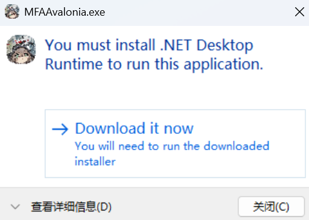
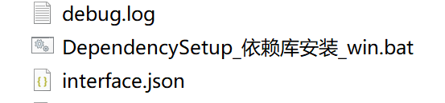
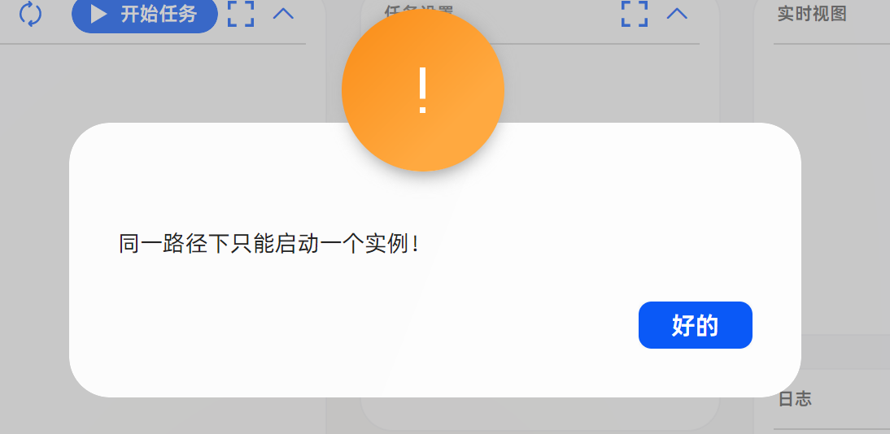
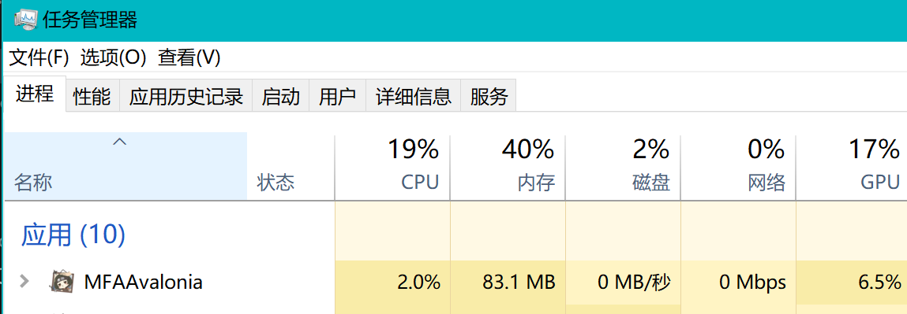
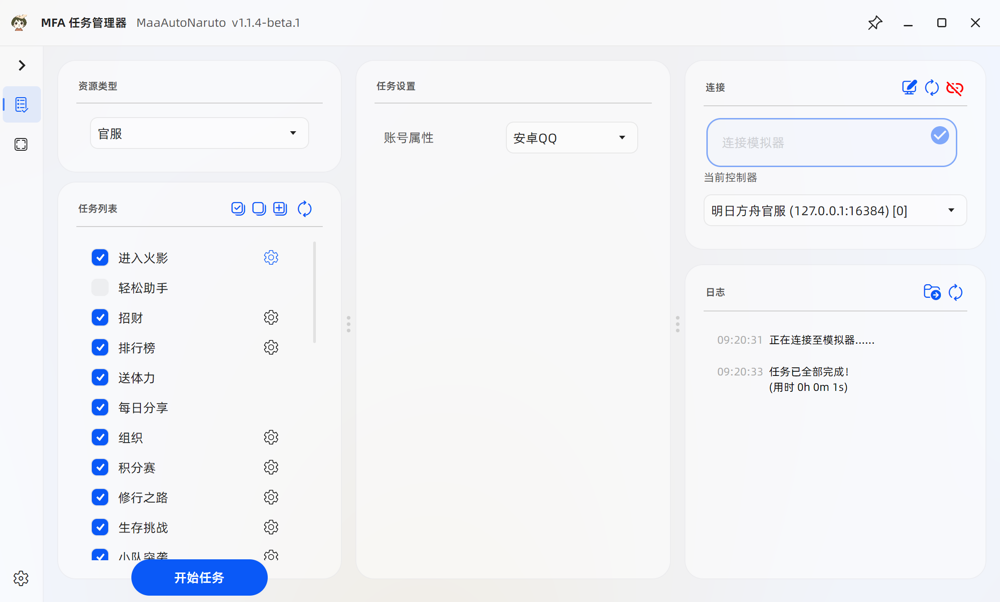
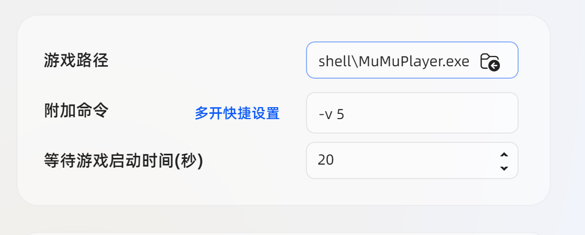

# 常见问题

**[敲黑板](#敲黑板)**

## 项目相关

1. Q: 硬件配置有要求吗？
    <!-- 参考文献 -->
    <!-- https://mumu.163.com/help/20251216/35048_1276766.html -->
    <!-- 没找到火影的，找了个差不多类型的 -->
    A: 最低配置:CPU i5 9400 及以上，显卡 GTX 1650 Super 4G 独显及以上，内存8G及以上。

2. Q: 可以在手机上用吗？

    A: 不可以。

3. Q: 感觉没有xxx的xxx好用 / 为什么不做xxx功能？

    A: 开发组现在缺人，这些功能你来写吧。

4. Q: 打不开Github？

    A: 请使用科学上网忍具。

5. Q: 更新速度特别慢或无法更新？

    A: 可以试试[Mirror酱](https://mirrorchyan.com/zh/projects?rid=MaaAutoNaruto&os=windows&arch=x64&channel=stable&source=MaaAutoNarutogh-doc)高速下载服务。

## 软件启动问题

1. Q: 双击exe后无反应或出现以下弹窗怎么办？

    

    A: 运行目录内的依赖安装脚本并重启电脑即可。

    

    Q: 脚本运行失败或者无法运行怎么办？

    A: [QQ群](http://qm.qq.com/cgi-bin/qm/qr?_wv=1027&k=w32iIG_oNqlyIvZOH3qbg2cOHllU4AoD&authKey=insHpV13my%2BnmO%2FzaYF67WDLj%2B0Vh2XagAKZmlRbV4n7ARSZXXybvKC%2B66dDMhZf&noverify=0&group_code=1047724031)的群文件中有个名为`运行依赖`的文件夹，请手动下载并安装里面的**所有**程序。

    Q: 安装成功并重启后还是出现这个该弹窗怎么办？

    A: 将MAN目录下的文件全部删除，然后重新下载最新版的MAN。

2. Q: 解压后找不到exe或出现`此应用无法在你的电脑上运行`的提示

    A: 检查压缩包文件名是否带有`win-x86_64`字样。如果没有，就说明你下错了。

3. Q: 拖到桌面后启动不了

    A: 请看[如何创建快捷方式](https://www.bilibili.com/video/BV1oGwfedEGS)

4. Q: 如果是 MAC / Linux 用户，该如何使用？

    A: 请移步[M9A的用户手册](https://1999.fan/zh_cn/manual/newbie.html)自行学习相关解决方案。

5. Q: 同一路径下只能启动一个实例

    

    A: 如果需要多开，请单独复制一份打开

    Q:我确认我只开了一个但还是有这个提示

    A: 请在任务管理器中检查，之前关闭时是否还有进程残留。

    

## 无法连接模拟器

无法连接到模拟器请先按照以下步骤排查:

1. 直接点击开始任务，MFA会自动尝试重新搜索可用的模拟器。

2. 在`模拟器`的设置中开启`ADB`并关闭`网络桥接`。

3. 检查是否安装了“360手机助手”，“xxx刷机大师”，”应用宝”这种类型的软件，这些软件会占用adb。需要把他们都关闭并在`任务管理器`中检查后台是否干净。

4. 检查系统防火墙是否拦截了adb命令。

5. 如果是雷电模拟器，可以尝试在`MAN`的`连接设置`中将触控模式改为`MaaTouch`。

6. 重启电脑，系统会重置本地连接。

如果以上方案均不能解决问题，请[导出日志](./issue.md)进行反馈。

## MuMu 模拟器运行中闪退

如果软件在执行任务时突然退出，尤其是在情报社的福利站、金币助手等需要频繁截图的步骤发生，可以先检查
`debug/maafw.log`。出现以下任一日志通常表示 MuMu 专用高速截图发生异常：

```text
MuMuPlayerExtras::screencap Failed to capture display
failed to screencap
lhs_image_.size() != rhs_image_.size()
```

MuMu 专用高速截图异常后，MaaFramework 可能会重新连接截图服务。如果重连期间画面在
`1920×1080` 和 `1080×1920` 之间切换，可能导致 MFAAvalonia 异常退出。

可以切换到兼容性更高的通用 ADB 截图方式：

1. 停止任务并完全退出 `MFAAvalonia.exe`。
2. 备份 `config/instances/default.json`。如果使用了其他实例，请备份对应的实例配置文件。
3. 在实例配置的 `AdbDevice` 对象中，将以下字段修改为：

    ```json
    "ScreencapMethods": 7,
    "Config": "{}"
    ```

4. 保留原有的 `AdbPath`、`AdbSerial` 和 `InputMethods`，然后重新启动软件。

`ScreencapMethods: 7` 会启用三种通用无损 ADB 截图方式，由 MaaFramework 自动选择当前设备上可用且较快的一种。
该配置适用于 MuMu、雷电等安卓模拟器以及支持 ADB 的安卓设备，但截图速度可能略低于模拟器专用高速截图。

如果切换后仍然闪退，请同时提供 `debug/maafw.log`、`logs` 目录日志和 Windows 事件查看器中的应用程序错误记录。

## 软件使用问题

1. Q: 推荐什么模拟器

    A: 推荐用mumu官方版，不要用定制版。而且强烈建议不要用雷电，因为bug非常多。

2. Q: 更新检测失败

    A: 试试[Mirror酱](https://mirrorchyan.com/zh/projects?rid=MaaAutoNaruto&os=windows&arch=x64&channel=stable&source=MaaAutoNarutogh-doc)高速下载服务或自行前往GitHub仓库手动下载。

3. Q: 无法启动火影app或者启动后在桌面乱点?

    A: 在模拟器设置里把后台保活关掉（也可能叫应用保活）。

4. Q: 资源加载失败，Agent启动失败 ？

    A：请先删除旧版文件，然后重新下载解压。

## 模拟器多开

### adb 连接



如图为软件主页面，右上角的连接是本节需要关注的部分。

adb（即 Android 调试桥），MFA 通过它来与模拟器建立连接，如果未成功配置，所有的任务都无法成功运行。

一般来说，你只需要在打开模拟器后点击刷新，便可以自动被搜索连接。手动配置可以参考M9A的[连接设置](https://1999.fan/zh_cn/manual/connection.html)

**注意**:多开情况下可能有多个控制器，请选择正确的控制器！可以在软件左侧切换第二个页面，在这里截图测试，判断是否正确连接。

### 打开软件时自动启动模拟器

参加[启动时拉起模拟器和启动后自动运行](#启动时拉起模拟器和启动后自动运行)

### 多开模拟器无法记住上次连接设备

当存在多个 ADB 设备时，程序启动时会自动搜索可用连接，手动配置的 ADB 连接可能会被覆盖。

**解决方案**:在`连接设置`中关闭`使用指纹匹配设备`和「连接失败时自动搜寻可用设备」两个选项。

## 自动启动与自动运行

### 开机时启动

可以参考[这篇文章](https://www.cnblogs.com/junfanzy/p/18965907)

### 定时启动

可以参考[这篇文章](https://www.cnblogs.com/Acezhang/p/15125851.html)

### 启动时拉起模拟器和启动后自动运行

启动前的操作有`启动软件`和`启动软件并启动脚本`，这里的软件指模拟器，脚本指 MAN。如果你希望启动后立即运行，就在启动设置里将启动后操作设为`启动模拟器并启动脚本`，然后填写对应模拟器的可执行文件，MuMu 模拟器的参考如下:

| MuMu12 模拟器(旧) | MuMu12 模拟器V5(新) |
| :---: | :---: |
| `{安装目录}\shell\MuMuPlayer.exe` | `{安装目录}\\nx_device\12.0\shell\MuMuNxDevice.exe` |

游戏路径选择`MuMuPlayer.exe`所在的位置。附加命令请使用`多开快捷设置`填写。`启动后尝试连接时长`应填写为等待模拟器启动的时间（以个人实际情况为准）。


**附加命令**是正确启动多开模拟器的关键，填错的话基本都是启动的模拟器本体。
> [!WARNING]
>
> 如果没有多开模拟器以外的特殊需求，你应该使用`多开快捷设置`来填写此项。



| 模拟器 | 命令格式 | 示例 |
| :---: | :---: | :---: |
| MuMu | `-v 多开号` | `-v 1` |
| 雷电 | `index=多开号` | `index=1` |

多开号从0开始，0代表模拟器本体，1代表第一个多开模拟器，依次类推。

以上内容就表示启动在MuMu第五个虚拟机。

## 敲黑板

1. MaaAutoNaruto不喜欢站街特效的查克拉

    已经完全看不见字了！

    

2. MaaAutoNaruto不喜欢特殊轮盘忍者的查克拉

    目前已知的有:`波风水门[九喇嘛连结]`，`长十郎[六代目水影]`

    这些忍者的技能无法直接使用连点器触发。

3. `MuMu模拟器`不喜欢`雷电模拟器`的查克拉，请不要同时使用这两个模拟器。相关问题概不负责。

4. `雷电模拟器`的官方适配器有问题，不要在雷电模拟器使用刷周胜功能。相关问题概不负责。
